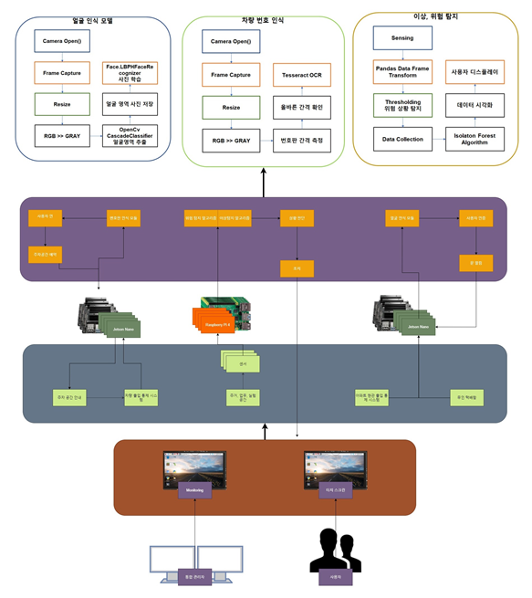
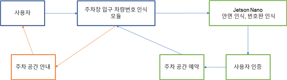
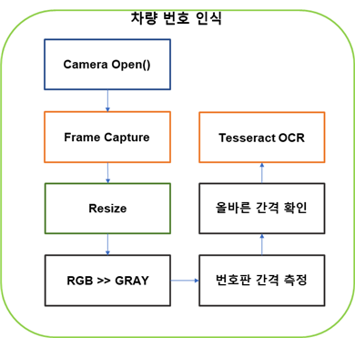
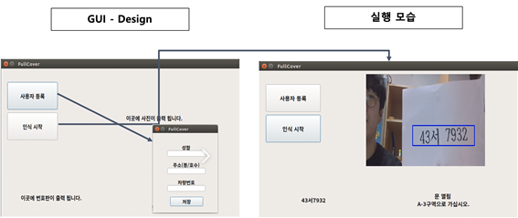
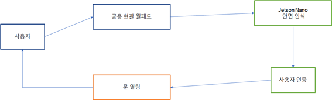
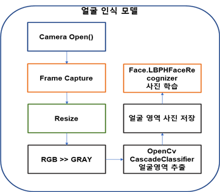
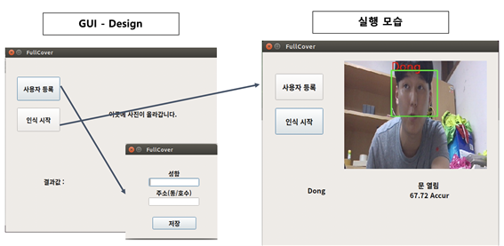
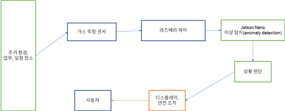
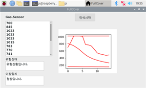

# FullCover
Capstone Design Project in Dankook Univ. __(Smart Residential Environment Service Using  IoT Technology)__

- 1.Auto Apartment entering system Using Face Recognition 
- 2.Auto Parking system Using char. Recognition
- 3.Anomaly and Dangerous Detection using isolation Forest

#Dependecy
> Python3  
> OpenCV  
> pytesseract  
> numpy  

# Contect
> email - donghark03@naver.com  
> Dankook Univ. software Dept.  
> Team : 박동학, 방승환, 홍승기, 김승준  

# Diagram

# car_number_recognition

# 

#

# Face_recogniation

#

#

#anomally detection

#

#

#
